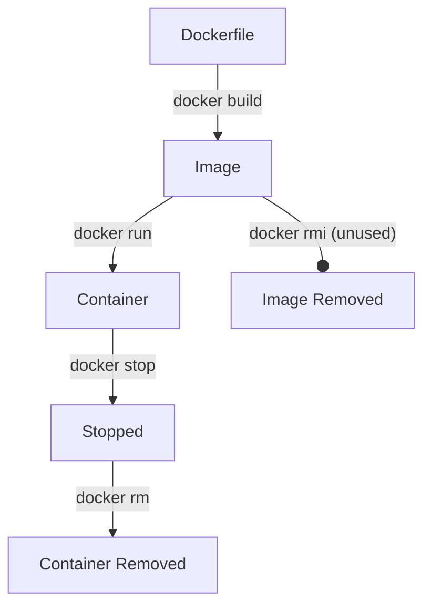
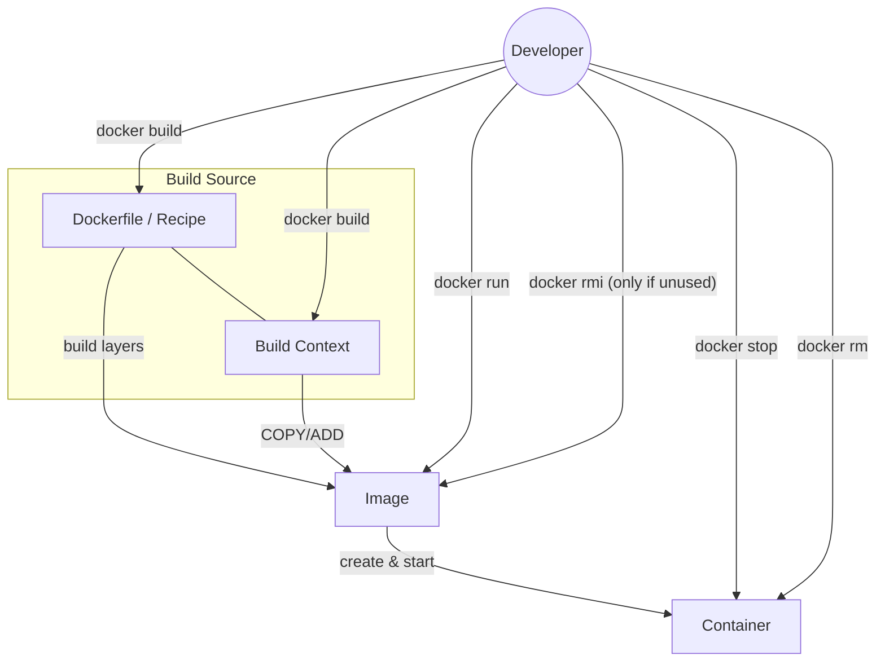
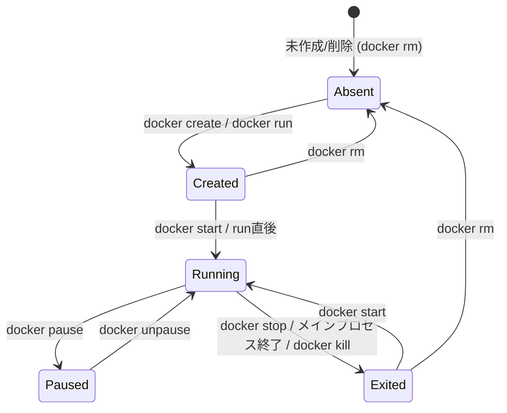
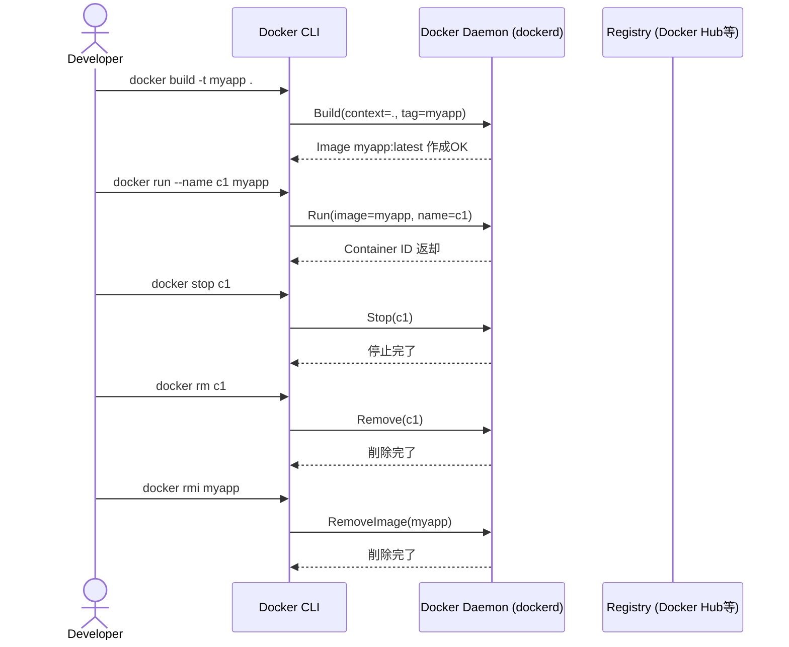
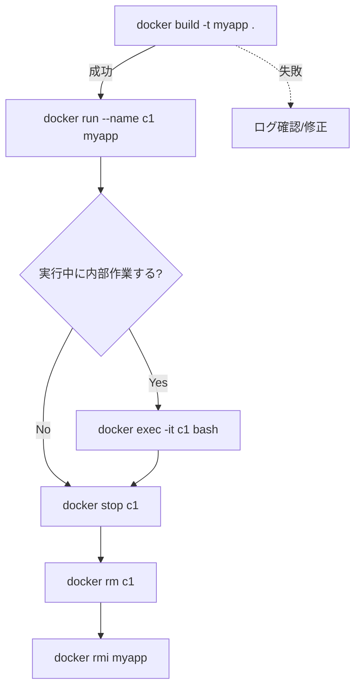

# Docker

- [Docker](#docker)
  - [概要図（フロー／ライフサイクル／やりとり）](#概要図フローライフサイクルやりとり)
    - [A) コンテナ生成の流れ（フローチャート：簡易版）](#a-コンテナ生成の流れフローチャート簡易版)
    - [B) コンテナ生成の流れ（フローチャート：詳細版）](#b-コンテナ生成の流れフローチャート詳細版)
    - [C) コンテナのライフサイクル（状態遷移）](#c-コンテナのライフサイクル状態遷移)
    - [D) コマンド実行のやりとり（シーケンス）](#d-コマンド実行のやりとりシーケンス)
    - [E) 一連の作業（アクティビティ）](#e-一連の作業アクティビティ)
  - [基本コマンド集](#基本コマンド集)
    - [1. イメージ関連（設計図）](#1-イメージ関連設計図)
    - [2. コンテナ関連（実体）](#2-コンテナ関連実体)
      - [実行（作成＋起動）](#実行作成起動)
      - [確認](#確認)
      - [操作](#操作)
    - [3. Dockerfile からビルド（create image）](#3-dockerfile-からビルドcreate-image)
    - [4. クリーンアップ](#4-クリーンアップ)
    - [5. 情報確認](#5-情報確認)
  - [よく使う組み合わせ例](#よく使う組み合わせ例)
  - [コンテナをスナップショット→配布（commit/save/load）](#コンテナをスナップショット配布commitsaveload)
  - [実行中コンテナのシェルに入る](#実行中コンテナのシェルに入る)
  - [開発用サンプル：Python + Node + Java](#開発用サンプルpython--node--java)
  - [開発用サンプル：Java](#開発用サンプルjava)
    - [myapp.jar を取り込む場合](#myappjar-を取り込む場合)
      - [前提](#前提)
      - [内容を更新したい場合](#内容を更新したい場合)
    - [JAR をホストからマウントする場合](#jar-をホストからマウントする場合)
  - [補足の要点（FAQ）](#補足の要点faq)
  - [DockerHubのイメージを使う場合](#dockerhubのイメージを使う場合)
    - [1. イメージを取得する（pull）](#1-イメージを取得するpull)
    - [2. コンテナを実行する（run）](#2-コンテナを実行するrun)
    - [3. よく使う公式イメージ](#3-よく使う公式イメージ)
    - [4. 実践パターン](#4-実践パターン)
    - [5. 公式イメージとコミュニティイメージ](#5-公式イメージとコミュニティイメージ)


## 概要図（フロー／ライフサイクル／やりとり）

### A) コンテナ生成の流れ（フローチャート：簡易版）



### B) コンテナ生成の流れ（フローチャート：詳細版）



### C) コンテナのライフサイクル（状態遷移）



### D) コマンド実行のやりとり（シーケンス）



### E) 一連の作業（アクティビティ）



---

## 基本コマンド集

### 1. イメージ関連（設計図）

```bash
# 取得（pull）
docker pull ubuntu:22.04

# 一覧
docker images

# 削除
docker rmi <IMAGE_ID|NAME:TAG>
```

### 2. コンテナ関連（実体）

#### 実行（作成＋起動）

```bash
# 標準
docker run -it ubuntu bash

# 終了後に自動削除（ゴミ残さない）
docker run --rm ubuntu bash

# カレントをマウント
docker run -it -v "$(pwd)":/workspace ubuntu bash

# ポート公開（ホスト:コンテナ）
docker run -it -p 8080:80 nginx
```

#### 確認

```bash
docker ps          # 起動中
docker ps -a       # 停止中も含む
docker logs <CONTAINER>   # ログ
```

#### 操作

```bash
docker exec -it <CONTAINER> bash   # 中に入る（/bin/sh のことも）
docker stop <CONTAINER>            # 停止
docker rm   <CONTAINER>            # 削除（停止済み）
```

### 3. Dockerfile からビルド（create image）

```bash
docker build -t myapp:latest .
```

### 4. クリーンアップ

```bash
docker container prune           # 停止中コンテナを一括削除
docker image prune               # 未使用イメージ（dangling）削除
docker image prune -a            # 参照されない全未使用イメージ
docker system prune -a           # ネットワーク/ビルドキャッシュ等まとめて
```

> `-a` を付けると「**どのコンテナからも使われていない**」イメージまで消えます。
> 必要なイメージが消えないか注意。

### 5. 情報確認

```bash
docker version
docker info
```

---

## よく使う組み合わせ例

```bash
# テスト用にサクッと実行して即削除
docker run --rm -it ubuntu bash

# Web サーバーを試す
docker run --rm -p 8080:80 nginx

# プロジェクトをコンテナ内で編集
docker run --rm -it -v "$(pwd)":/workspace python:3.12 bash
```

---

## コンテナをスナップショット→配布（commit/save/load）

1. 対象コンテナを確認

```bash
docker ps -a
```

2. コンテナ → イメージ化（スナップショット）

```bash
docker commit <CONTAINER> my-snapshot:1.0
```

3. イメージを tar でエクスポート（配布用）

```bash
docker save my-snapshot:1.0 -o my-snapshot.tar
```

4. 別環境で読み込み

```bash
docker load -i my-snapshot.tar
```

> 似たコマンド：`docker export` は **コンテナのファイルシステム**のみを書き出し、メタデータ（履歴・環境変数・CMD など）は含まれません。
> 配布・再利用には通常 `commit` → `save`/`load` が無難です。


## 実行中コンテナのシェルに入る

```bash
docker exec -it <CONTAINER> bash  # 例：/bin/bash がある場合
# /bin/bash が無いイメージは /bin/sh を使う
docker exec -it <CONTAINER> sh
```

* `-i` : 標準入力を有効化
* `-t` : 疑似TTY割り当て


## 開発用サンプル：Python + Node + Java

```bash
prj="<myproject>"

mkdir $prj && cd $prj
cat <<'EOF' > Dockerfile
FROM ubuntu:22.04

# 基本ツール
RUN apt-get update && DEBIAN_FRONTEND=noninteractive apt-get install -y \
    curl ca-certificates gnupg lsb-release \
    python3 python3-venv python3-pip \
    openjdk-21-jdk \
 && rm -rf /var/lib/apt/lists/*

# NodeSource 公式リポジトリで Node.js をインストール（LTS/Current はURLで切替）
RUN curl -fsSL https://deb.nodesource.com/setup_lts.x | bash - \
 && apt-get install -y nodejs \
 && rm -rf /var/lib/apt/lists/*

# バージョン確認（キャッシュ固定の目印、任意）
RUN node -v && npm -v && java -version && python3 --version

WORKDIR /workspace
EOF

cat <<'EOF' > .dockerignore
.git
.gitignore
.env
*.pem
*.key
*.crt
.mvn/

# ビルド生成物
target/
build/
dist/
node_modules/
.vscode/
.venv/
__pycache__/
.DS_Store
EOF
```

ビルド & 起動

```bash
docker build -t $prj .
docker run -it --rm -v "$(pwd)":/workspace $prj bash
```

> 💡 **再ビルドは変更したときだけ**。イメージはキャッシュされるので毎回ビルド不要。`docker run ... $prj bash` は何回でもOK。


## 開発用サンプル：Java

### myapp.jar を取り込む場合

#### 前提

プロジェクト内に gradlew / gradle/wrapper がある

以下の設定で成果物名が固定されている

``` text
tasks.named("jar") {
    archiveFileName = "myapp.jar"
}
```


```bash
mkdir devtest && cd devtest

cat <<'EOF' > Dockerfile
# ====== 1) Build stage ======
FROM eclipse-temurin:21-jdk AS build
WORKDIR /src

# 依存解決をキャッシュさせるために build 定義だけ先にコピー
COPY gradlew ./
COPY gradle gradle
COPY build.gradle* settings.gradle* gradle.properties ./
RUN chmod +x gradlew
# 依存ダウンロードだけ先に（ソース未コピーでもOK）
RUN ./gradlew --no-daemon dependencies || true

# 残りのソースをコピーしてビルド（テストは任意でスキップ）
COPY . .
RUN ./gradlew --no-daemon build -x test

# ====== 2) Runtime stage ======
FROM eclipse-temurin:21-jre
WORKDIR /app

# 成果物をコピー（jar名が固定でない場合は *.jar などを使う）
# → jar 名を固定したいなら build.gradle で archiveFileName を設定しておくと安心
COPY --from=build /src/build/libs/myapp.jar /app/app.jar

CMD ["java","-jar","/app/app.jar"]
EOF

cat <<'EOF' > .dockerignore
.git
.gitignore
.env
*.pem
*.key
*.crt

.gradle/
build/
**/build/
.idea/
.vscode/
*.iml
EOF

```

ビルド & 起動

```bash
docker build -t myapp:latest .

# JAR を起動（必要ならポートを公開）
docker run -d --name myapp -p 8080:8080 myapp:latest
```

- シェルで中を見たいときは、--entrypoint で一時的に上書き：

```bash
docker run --rm -it --entrypoint bash myapp:latest
```

イメージ内にbashがない場合
```bash
docker run --rm -it --entrypoint sh myapp:latest
```


#### 内容を更新したい場合

最短パターン（同じタグを使い回す）

```bash
# 1) JARを差し替えたうえで再ビルド
docker build -t myapp:latest .

# 2) 旧コンテナを止めて消す（存在する場合）
docker stop myapp || true
docker rm myapp || true

# 3) 新イメージで起動
docker run -d --name myapp -p 8080:8080 myapp:latest
```


>- myapp:latest を毎回上書きする方式。
>- stop/rm はコンテナ名を付けていると扱いやすい。
>- ポートはアプリに合わせて調整。


### JAR をホストからマウントする場合

Dockerfile で固定せず、実行時にホストのファイルをマウントする方法：

```bash
docker run -it --rm \
  -p 8080:8080 \
  -v "$(pwd)/myapp.jar":/app/myapp.jar \
  openjdk:21 \
  java -jar /app/myapp.jar
```

>この場合、jar を更新すれば再ビルド不要で即反映。
>開発中はこちらが便利。


## 補足の要点（FAQ）

* **`docker run` と `docker exec` の違い**

  * `run` は **イメージから新しいコンテナを作成して起動**。
  * `exec` は **実行中コンテナに追加コマンドを実行**（あとから中に入る等）。

* **コンテナが終了する条件**

  * **PID 1（メインプロセス）が終了**するとコンテナは終了します。`ENTRYPOINT`/`CMD` のプロセスがフォアグラウンドで常駐している必要があります。

* **`ENTRYPOINT` と `CMD`**

  * `ENTRYPOINT`：常に実行される “エントリ”（例：`["nginx","-g","daemon off;"]`）
  * `CMD`：デフォルト引数（`docker run` で上書き可能）
  * 両方指定時は `ENTRYPOINT CMD` の形で結合されます。
  * 公式 `nginx` は `daemon off;` でフォアグラウンド常駐 ⇒ `docker exec` で入れる（コンテナが動いているため）。

* **複数プロセスを動かしたい**

  * 原則「1コンテナ1プロセス」が推奨。どうしても複数なら `supervisord` などのプロセス管理を使うか、**compose で複数コンテナ**に分ける方が保守的。

* **ログの見る場所**

  * 標準は `stdout/stderr` に出す → `docker logs` で閲覧。デーモン化させず**フォアグラウンド**で動かすのがベストプラクティス。


## DockerHubのイメージを使う場合

### 1. イメージを取得する（pull）

```bash
# 公式イメージをダウンロード
docker pull ubuntu:22.04
docker pull nginx:latest
docker pull python:3.12
```

* **形式**: `docker pull <リポジトリ名>:<タグ>`
* タグを省略すると `:latest` がデフォルト
* Docker Hub の URL は省略できる（`docker pull docker.io/library/ubuntu:22.04` と同じ）

### 2. コンテナを実行する（run）

```bash
# Ubuntu を対話モードで実行
docker run -it ubuntu:22.04 bash

# Nginx を起動してホスト8080番にマッピング
docker run -d -p 8080:80 nginx:latest
```

* `-it` : 対話モード（シェルに入るとき）
* `-d`  : デタッチモード（バックグラウンド）
* `-p`  : ポートマッピング（`ホスト:コンテナ`）

### 3. よく使う公式イメージ

| ソフトウェア  | 公式イメージ例        | 備考               |
| ------- | -------------- | ---------------- |
| Ubuntu  | `ubuntu:22.04` | 軽量ベースイメージとしてよく使う |
| Alpine  | `alpine:3.19`  | 最小限 Linux、非常に軽い  |
| Python  | `python:3.12`  | pip, venv も利用可   |
| Node.js | `node:20`      | npm, yarn も利用可   |
| OpenJDK | `openjdk:21`   | Java 開発環境        |
| Nginx   | `nginx:latest` | Web サーバー         |
| MySQL   | `mysql:8`      | データベース           |
| MariaDB | `mariadb:11`   | データベース           |
| Redis   | `redis:7`      | インメモリ KVS        |

### 4. 実践パターン

```bash
# すぐに試して終了時に削除
docker run --rm -it python:3.12 python3

# ソースコードをホストからマウントして開発
docker run --rm -it -v "$(pwd)":/app python:3.12 bash

# データベースを立てる（永続化する場合は volume を指定）
docker run -d --name mydb -e MYSQL_ROOT_PASSWORD=secret mysql:8

# ubuntuをずっと起動しておきたい場合
docker run -dit --name test ubuntu:22.04 bash #コンテナ起動
docker exec -it test bash  # 別のシェルから exec
```


### 5. 公式イメージとコミュニティイメージ

* **公式イメージ**
  `library/ubuntu`, `library/nginx`, `library/python` のように「library」名前空間にあるもの。セキュリティや更新頻度も安心。
  → `docker pull ubuntu` と書けば公式の `library/ubuntu` が取れる。

* **コミュニティ提供イメージ**
  `username/repo:tag` の形（例: `bitnami/mysql:8`）。公式に無い拡張機能入りのものもある。
  → 利用時は Docker Hub のページをよく確認して信頼できるか判断する。

